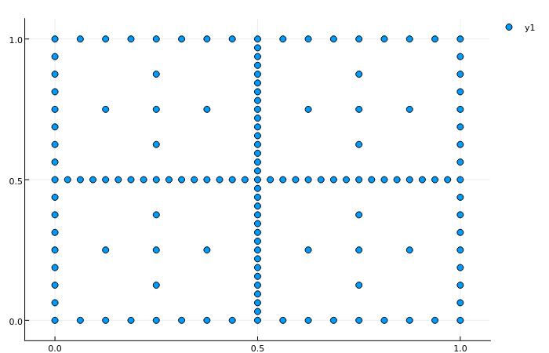

# SparseInterp


A package for function approximation on sparse grids.

Grids are constructed using the:
```
NGrid(L::Vector{Int}, bounds::Array{Float64,2} = [zeros(..);ones(..)]; B = Linear)
``` 

`L`: An `n` dimensional vector where each element specifies the grid 'fineness' in each dimension.

`bounds`: A [2 x `n`] array specifying the lower and upper bounds in each dimension, defaults to [0, 1]<sup>n</sup>.

`B`: This specifies the type of basis function used. Defaults to a `Linear` hat function. A `Quadratic` basis function can also be used if the function being approximated is sufficiently smooth.

`values(G::NGrid)`: returns an array where each row is a grid node.

### Interpolation
`NGrid` instances are callable taking two arguments:
```
G(A::Vector{Float64}, x::Array{Float64})
```
Where `A` are the function values at each grid node and `x` the points to be evaluated.


### Example

```
using SparseInterp, Plots
G = NGrid([7,5], [-2. -1; 2 3], B = Quadratic)
rosenbrock(x,y) = (1 - x).^2 + 100*(y - x.^2).^2
X = values(G)[:,1]
Y = values(G)[:,2]
Z = rosenbrock(X, Y)
x,y = SparseInterp.ndgrid(linspace(-2,2,50), linspace(-1,3,50))
z = rosenbrock(x[:], y[:])
z0 = G(Z, [x[:] y[:]])


scatter(x[:], y[:], z0)

scatter(x[:], y[:], z - z0)
```


### Note
The interpolation function makes use of the `:jl_threading_run` which scales well on tested machines but is an experimental feature...
<!---->